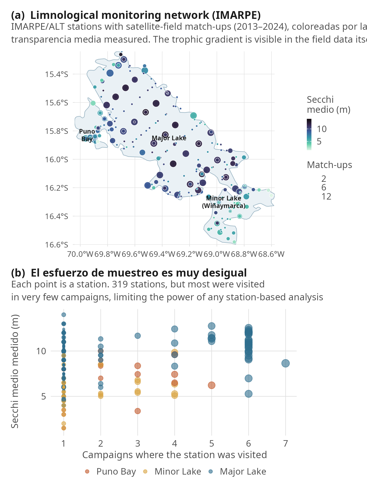
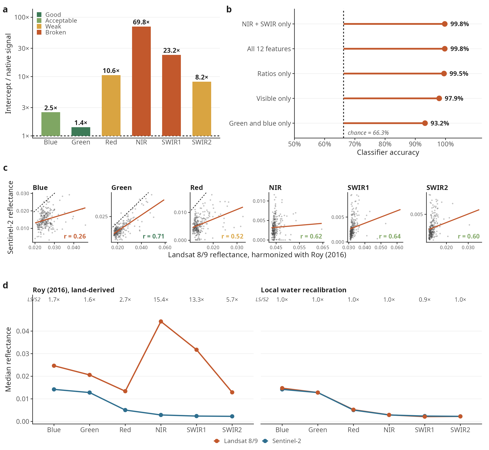
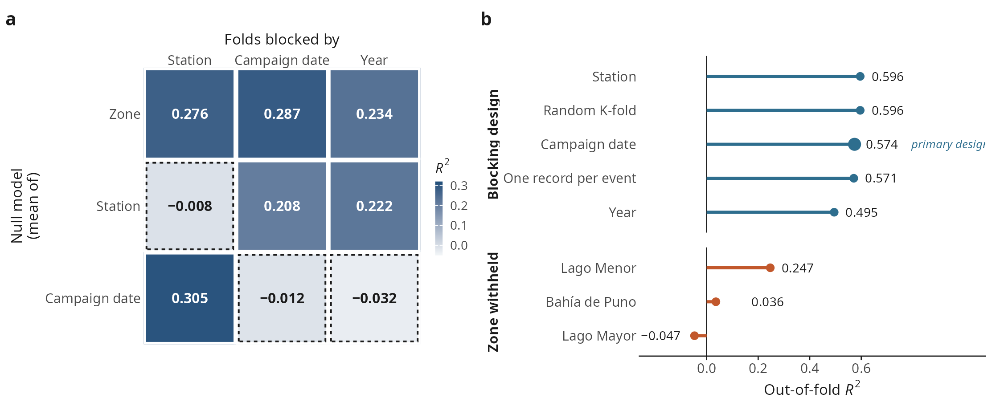
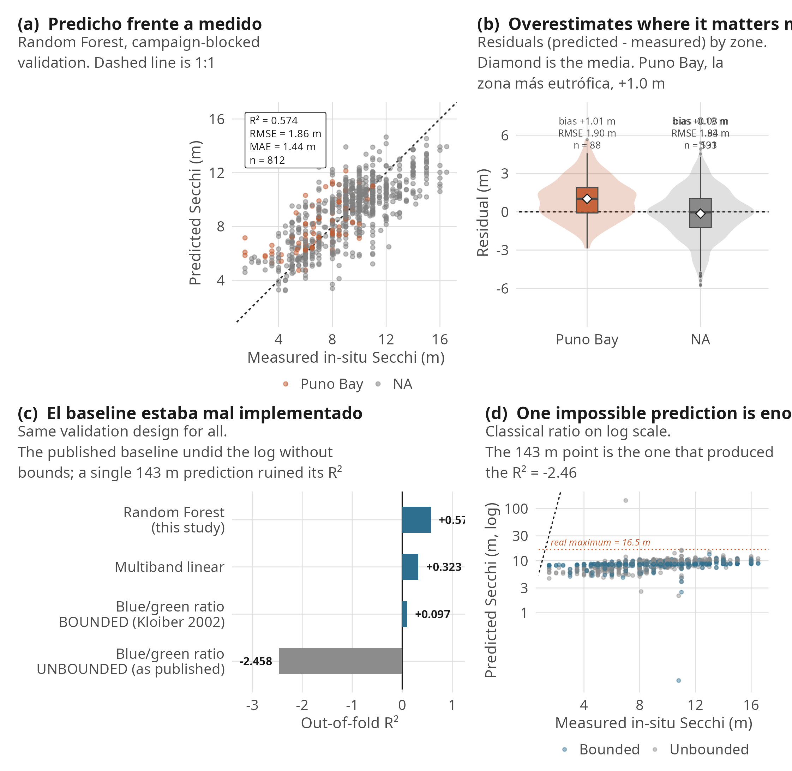
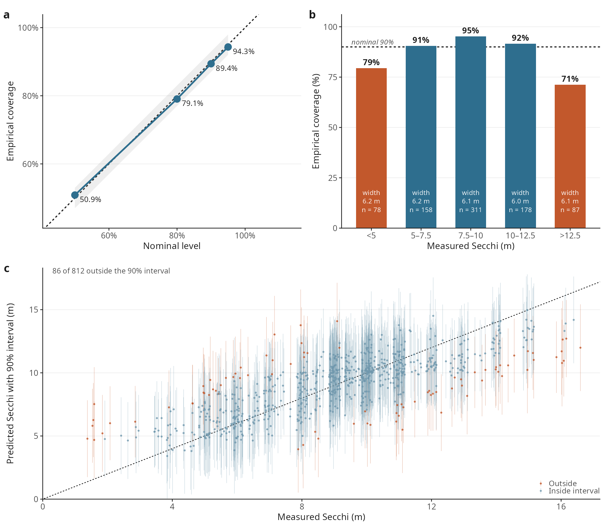
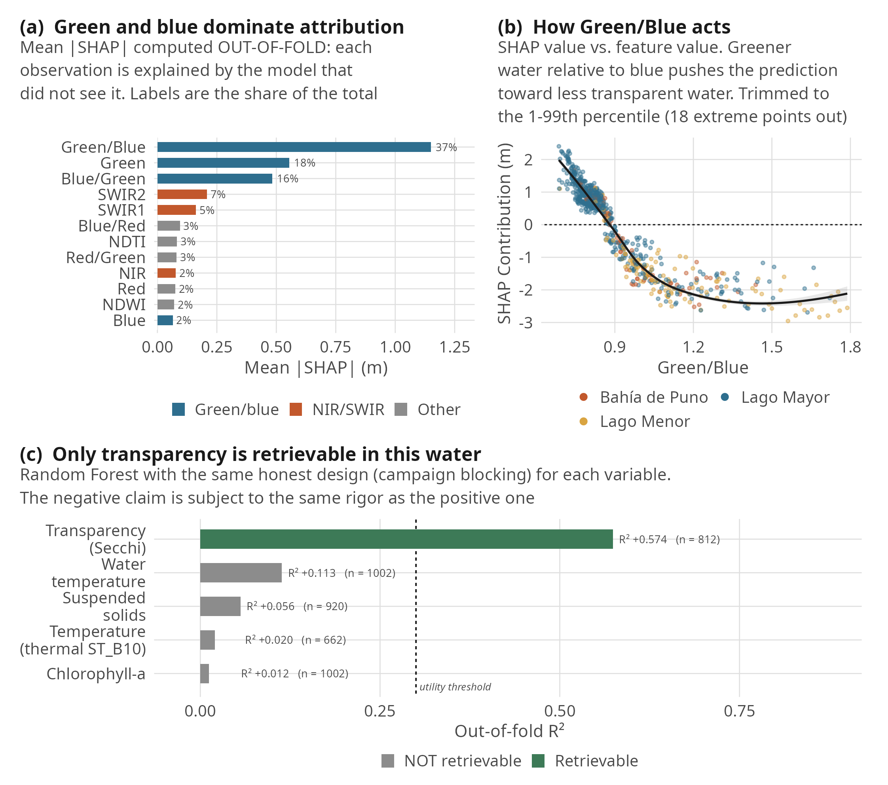

# Harmonization and Validation Limits of Satellite Secchi Retrieval in Lake Titicaca

Reproducible code and data for a study of what a defensible machine-learning water
transparency product looks like in a clear, high-altitude great lake — and of two
practices, imported from the turbid-water literature, that fail there.

[](LICENSE)
[](https://www.python.org/)
[](https://www.r-project.org/)
[](https://www.sciencedirect.com/journal/journal-of-great-lakes-research)
[](#citation)

**Manuscript:** *Harmonization and validation limits of satellite Secchi retrieval in
Lake Titicaca* — being prepared for the Journal of Great Lakes Research (Elsevier /
IAGLR). **Not yet submitted.**

This repository holds the code and the data. The manuscript itself is not mirrored
here: while it is unpublished there is no citable version of record, and a PDF in a
repository only creates ambiguity about which draft is current.

* * *

## Overview

Lake Titicaca (8,372 km², 3,810 m a.s.l.) is the largest lake in South America and, by
volume, the largest tropical lake in the world. It is a transboundary Ramsar site and
the freshwater reserve for millions of Andean people, yet its water quality is
documented only by infrequent field campaigns.



*The 143 IMARPE/ALT stations with a satellite–field match-up, coloured by mean measured
Secchi depth. The trophic gradient — turbid Bahía de Puno, intermediate Lago Menor,
clear Lago Mayor — is visible in the field data alone. Most stations were visited in
very few campaigns.*

We assemble **1,002 real satellite–field match-ups** (812 carrying a Secchi reading)
from Sentinel-2 MSI and Landsat 8/9 OLI against twelve years of IMARPE limnological
monitoring, and ask what a defensible retrieval looks like. The study is as much about
**how to evaluate** such a product as about the product itself: for each of the two
failures below we give a diagnostic that costs one model fit and that any study can run.

* * *

## Key results

Values in the manuscript's running text are macros generated by `p09`; values in its
tables are typed, and `p10` checks all 117 of them against `results/tidy/` on every
run, failing the build on any mismatch. It found two stale cells the first time it ran.

### 1. Land-derived harmonization is invalid over dark water



*(a) The Roy intercept relative to the native over-water Landsat signal. (b) A
classifier recovering the source sensor from harmonized features; under a successful
harmonization it would sit at chance. (c) Sentinel-2 vs harmonized Landsat on 270
paired events. (d) Median spectral signature before and after local recalibration.*

The per-band coefficients of Roy et al. (2016), fitted on vegetation and soil, are the
most reused transform for merging Landsat into Sentinel-2 archives. Over clear water
their additive intercepts **exceed the entire native Landsat signal**:

| Band | Blue | Green | Red | NIR | SWIR1 | SWIR2 |
|---|:--:|:--:|:--:|:--:|:--:|:--:|
| Intercept / native signal | 2.5× | 1.4× | 10.6× | **69.8×** | 23.2× | 8.2× |

A Random Forest recovers the **source sensor** from the *already harmonized* reflectance
with **99.8 % accuracy** against a 66.3 % chance rate — the retrieval was learning a
sensor label, not unified optics. Refitting locally on 270 same-day paired observations
restores the aggregate spectral signature but not per-observation agreement: green
recovers (*r* = 0.71), blue does not (*r* = 0.26). Blue is the band the retrieval most
depends on.

> **Diagnostic:** a classifier two-sample test. If a classifier can still tell the
> sensors apart after harmonization, the harmonization has not worked.

### 2. The campaign, not the station, is the blocking unit



*(a) Null models under campaign-date-blocked folds. (b) Out-of-fold R² under each
validation design and under extrapolation to an unseen trophic zone.*

Blocking cross-validation by monitoring station is the usual remedy for spatial
autocorrelation. In a campaign-based programme it leaves the dominant dependence
untouched. Three null models — each predicting **only the training-set mean of one
grouping** — under each blocking design:

| Null model ↓ / folds blocked by → | Station | Campaign date | Year (= whole campaign) |
|---|:--:|:--:|:--:|
| Zone mean | 0.276 | 0.287 | 0.234 |
| Station mean | −0.008 | 0.208 | 0.222 |
| Campaign-date mean | **0.305** | −0.012 | −0.032 |

Each unit collapses its own null by construction — that is the diagonal, and it proves
nothing. What matters is what survives off it: under **station-blocked** folds a null
that knows only the campaign date still explains **R² = 0.305**. The temporal structure
passes through station blocking untouched. The zone mean explains 0.23–0.29 under
*every* design, which is the trophic gradient — a property of the lake a model should
learn, not leakage.

Consistently, station blocking changes the reported accuracy not at all:

| Validation design | R² | RMSE (m) | n |
|---|:--:|:--:|:--:|
| Random K-fold | 0.596 | 1.81 | 812 |
| Station-blocked | 0.596 | 1.81 | 812 |
| **Campaign-date-blocked (primary)** | **0.574** | **1.86** | 812 |
| Year-blocked (= whole campaign) | 0.495 | 2.02 | 812 |
| One record per in-situ event | 0.571 | 1.77 | 540 |

The nine field campaigns span 7–27 days each (median 13 sampling dates), so
date-blocking can still put two days of one campaign on opposite sides of a split.
Year-blocking isolates whole campaigns and gives 0.495; the 0.079 gap bounds the
residual within-campaign dependence. Date-blocking stays primary because nine
year-groups leave too few folds for stable cross-validation and conformal calibration.
Both figures are reported.

> **Diagnostic:** run every candidate null under every candidate blocking design, and
> read the off-diagonal.

### 3. Retrieval, benchmarks and where it stops working



*(a) Out-of-fold predicted vs measured. (b) Residuals by trophic zone. (c) Benchmark
against classical and linear baselines. (d) The unbounded classical implementation: one
impossible prediction destroys the metric.*

Random Forest, campaign-date-blocked: **R² = 0.574, RMSE 1.86 m, MAE 1.44 m,
bias −0.02 m (n = 812)**.

| Model | R² | RMSE (m) |
|---|:--:|:--:|
| **Random Forest (this study)** | **0.574** | 1.86 |
| Multiband linear regression | 0.323 | 2.34 |
| Classical blue/green ratio, bounded (Kloiber 2002) | 0.097 | 2.71 |
| Classical blue/green ratio, unbounded as published | −2.458 | 5.29 |

The unbounded baseline is a straw man: undoing the log without bounds emits a single
**143.5 m** prediction against an observed maximum of 16.5 m, and that one value alone
drives R² to −2.46. Benchmarks of classical algorithms reported without physical bounds
manufacture an arbitrarily large advantage for the machine-learning model.

**Extrapolation fails.** Withholding an entire trophic zone:

| Held-out zone | R² | RMSE (m) | Bias (m) |
|---|:--:|:--:|:--:|
| Lago Menor | 0.247 | 1.90 | +0.02 |
| Bahía de Puno | 0.036 | 2.11 | +1.35 |
| Lago Mayor | −0.047 | 2.52 | −1.48 |

The model interpolates within optical regimes it has seen; it does not transfer to a
water type absent from training.

### 4. The match-up window is not what drives the result

A ±10-day window is wide for a lake whose near-shore transparency responds to wind and
river discharge within days. Every match-up was re-extracted at four windows and
re-evaluated under the primary design:

| Window | Match-ups | Campaigns | R² | RMSE (m) |
|---|:--:|:--:|:--:|:--:|
| ±1 day | 186 | 41 | 0.516 | 2.23 |
| ±3 days | 495 | 79 | 0.563 | 2.02 |
| ±5 days | 661 | 94 | 0.556 | 1.99 |
| **±10 days** | **812** | **120** | **0.565** | **1.88** |

Accuracy is flat across the four settings. Had the wide window been admitting stale
observations, tightening it should have raised accuracy; it does not. What narrowing
costs is data — ±1 day keeps 186 of 812 match-ups and 41 of 120 campaign blocks, too
few for the validation design this study argues for. RMSE is not comparable across rows,
because each window defines a different sample.

The re-extraction doubles as a reproducibility check: at ±10 days it recovers **810 of
810** unique match-ups from the published analysis, with per-band reflectance
correlating at **r ≥ 0.995** and a median difference of zero.

The extraction it rests on is versioned
(`data/processed/window_sensitivity_raw.csv`, 184 KB), so the analysis re-runs from this
repository with `python pipeline/p11_window_sensitivity.py --eval`. Re-extracting from
scratch is the only stage that needs Earth Engine credentials.

### 5. Uncertainty is calibrated on average, not conditionally



*(a) Empirical vs nominal coverage. (b) The 90 % interval against the measured value.
(c) Coverage conditional on measured transparency.*

| Nominal | 50 % | 80 % | 90 % | 95 % |
|---|:--:|:--:|:--:|:--:|
| Empirical coverage | 50.9 % | 79.1 % | **89.4 %** | 94.3 % |
| Mean width (m) | 2.50 | 4.61 | 6.12 | 7.37 |

Marginally well calibrated at every level. But split conformal derives a single global
quantile of absolute residuals, so the interval has constant width and cannot adapt:
coverage falls to **71.3 % in the clearest water** and 79.5 % in the most turbid, while
over-covering in the middle. Those extremes are where management decisions are made. A
marginal coverage figure alone would hide this.

### 6. Only transparency is retrievable in this water



*(a) Out-of-fold SHAP importance. (b) SHAP dependence on the leading feature, by zone.
(c) Retrievability of each variable under the same design.*

The same honest design applied to every co-measured variable:

| Variable | R² | n | Retrievable |
|---|:--:|:--:|:--:|
| Transparency (Secchi) | **0.574** | 812 | ✅ |
| Water temperature (in-situ) | 0.113 | 1,002 | ❌ |
| Suspended solids | 0.056 | 920 | ❌ |
| Temperature (thermal ST_B10) | 0.020 | 662 | ❌ |
| Chlorophyll-*a* | 0.012 | 1,002 | ❌ |

Their in-situ ranges lie below the optical and thermal detection limits of these sensors
in this oligotrophic regime. Out-of-fold SHAP attributes 72.6 % of the retrieval to
green and blue bands and their ratios, with the sign expected from water-clarity optics
— so the retrieval is grounded in optics rather than location memorization, while
resting on the band pair with the worst cross-sensor agreement. The negative claim is
held to the same standard as the positive one.

* * *

## Repository structure

```
.
├── pipeline/                 the analysis, in execution order
│   ├── p00_config.py                    paths, features, seed, shared validation design
│   ├── p01_build_dataset.py             analysis dataset + real inventory of gaps
│   ├── p02_fix1_harmonization.py        Roy (2016) transform over dark water
│   ├── p03_fix2_baselines.py            correctly implemented classical baseline
│   ├── p04_fix3_validation.py           blocking unit, null-model grid
│   ├── p05_fix4_temporal.py             temporal hold-out, seasonality, trend fragility
│   ├── p06_model_selection.py           nested CV + Optuna (slow, ~1 h)
│   ├── p07_uncertainty.py               conformal intervals, marginal and conditional
│   ├── p08_interpretability.py          out-of-fold SHAP + retrievability
│   ├── p09_export_manuscript_numbers.py exports every figure quoted in the text
│   ├── p10_verify_manuscript.py         checks the article against results/tidy/
│   ├── p11_window_sensitivity.py        match-up window ±1/±3/±5/±10 d (needs GEE)
│   └── run_all.sh                       reproduces everything, end to end
├── figures/R/                fig01–fig08 (ggplot2) + shared theme and palette
├── data/
│   ├── processed/            match-up tables (matchups_s2.csv, matchups_ls.csv),
│   │                         insitu_annual_medians.csv (input to the trend tests)
│   │                         and window_sensitivity_raw.csv (the p11 extraction)
│   ├── insitu/reference/     OEFA 2016 reference values and source metadata
│   └── lake_boundary/        lake geometry (Natural Earth, GPKG)
├── results/
│   ├── metrics/              one JSON per pipeline stage
│   ├── tidy/                 every table behind every figure, as CSV
│   └── figures_r/            manuscript figures (300 dpi PNG + vector PDF)
├── requirements.txt
└── LICENSE
```

Trained models and LaTeX sources are not versioned. The manuscript lives outside this
repository (see above); `p09` and `p10` detect its absence and skip.

* * *

## Installation

Python 3.11. The pinned versions are those the reported results were produced with.

```bash
git clone https://github.com/Andre031222/harmonized-titicaca-transparency.git
cd harmonized-titicaca-transparency

python3.11 -m venv .venv          # or: uv venv --python 3.11
.venv/bin/pip install -r requirements.txt
```

`run_all.sh` expects the interpreter at `.venv/bin/python`. Verify:

```bash
.venv/bin/python -c "import numpy, pandas, sklearn, xgboost, lightgbm, optuna, shap; print('ok')"
```

Figures are built in R (≥ 4.4), not Python:

```r
install.packages(c("ggplot2","patchwork","dplyr","tidyr","readr",
                   "forcats","scales","stringr","sf","viridis"))
```

* * *

## Reproducing the results

Everything in the article is reproducible from this repository alone — no Earth Engine
credentials and no access to the raw in-situ record needed. This is checked by running
the pipeline in a clean checkout: it reproduces all seven metric files and all 26 tidy
tables byte-identically.

```bash
bash pipeline/run_all.sh            # everything (~1.5 h, p06 dominates)
bash pipeline/run_all.sh --fast     # skip p06 model selection
bash pipeline/run_all.sh --no-tex   # skip the LaTeX build
```

| # | Stage | What it does |
|---|---|---|
| 1 | `p01_build_dataset` | Builds the analysis table from the match-ups; reports the real temporal inventory — which years and months have no data at all |
| 2 | `p02_fix1_harmonization` | Quantifies the Roy intercepts against the native over-water signal; runs the classifier two-sample test; refits water-specific coefficients |
| 3 | `p04_fix3_validation` | The null-model grid, the blocking hierarchy, leave-one-zone-out, error by zone |
| 4 | `p03_fix2_baselines` | The classical baseline, bounded and unbounded (imports from `p04`, so it runs after) |
| 5 | `p05_fix4_temporal` | Temporal hold-out, seasonal coverage, Mann–Kendall trends and their sensitivity to the start year |
| 6 | `p06_model_selection` | RF / ExtraTrees / XGBoost / LightGBM, tuned by Optuna inside nested CV, against seed-to-seed noise |
| 7 | `p07_uncertainty` | Split-conformal intervals; coverage marginal **and** conditional on transparency |
| 8 | `p08_interpretability` | Out-of-fold SHAP; retrievability of every co-measured variable |
| 9 | `p09` → `p10` | Exports the numbers, then verifies the article against `results/tidy/` |

One analysis sits outside `run_all.sh` because it is the only step that needs Earth
Engine credentials. `p11` re-extracts the match-ups at ±1, ±3, ±5 and ±10 days and
re-evaluates the retrieval under the primary design, testing whether the ±10-day
window is too wide for a lake where wind and river discharge can shift transparency
within days:

```bash
earthengine authenticate          # once
python pipeline/p11_window_sensitivity.py          # extract, then evaluate
python pipeline/p11_window_sensitivity.py --eval   # re-evaluate the cache only
```

Extraction is resumable and network-bound rather than CPU-bound.

Figures are rebuilt separately:

```bash
cd figures/R && for f in fig0*.R; do Rscript "$f"; done
```

Outputs land in `results/metrics/` (JSON), `results/tidy/` (CSV) and
`results/figures_r/` (PNG + PDF). A re-run leaves the tracked outputs byte-identical.

### Validation design

```
                      ┌─ random K-fold ──────────── 0.596   leaks
                      ├─ blocked by STATION ─────── 0.596   leaks (the null grid proves it)
   812 match-ups ─────┼─ blocked by CAMPAIGN DATE ─ 0.574   primary
   9 campaigns        ├─ blocked by YEAR ────────── 0.495   strict campaign-level bound
   2013–2024          └─ leave-one-zone-out ─────── 0.25 to −0.05   extrapolation fails
```

The blocking unit is diagnosed rather than assumed, the scaler is fitted inside the
training fold only, and SHAP is computed out of fold so each observation is explained
by a model that never saw it.

* * *

## Data

| Source | What | Availability |
|---|---|---|
| **IMARPE** limnological campaigns | In-situ Secchi, chlorophyll-*a*, suspended solids, temperature, pH, dissolved oxygen, nutrients — 881 measurements, 2011–2024, 160 station identifiers (154 distinct stations), 734 with a valid Secchi reading | Published monitoring records; the July 2019 campaign is in Siguayro & Franco (2022). The raw compilation is not redistributed here — available on request |
| **OEFA (2016)** | Reference values, inner Puno Bay | Public government report |
| **Sentinel-2 MSI / Landsat 8-9 OLI** | Surface reflectance, Collection 2 Level-2 | Free via [Google Earth Engine](https://earthengine.google.com) |
| **Match-up tables** (`data/processed/`) | 1,002 satellite ↔ in-situ pairs (340 Sentinel-2, 662 Landsat 8/9); 812 carry a Secchi reading | **Versioned in this repository** |
| **Annual medians** (`data/processed/insitu_annual_medians.csv`) | Median Secchi per trophic zone per year, 2011–2024, with the count behind each — the input the Mann–Kendall tests actually consume | **Versioned in this repository** |

Trends are computed on the full in-situ record rather than the match-up subset, because
they are a claim about the lake and not about cloud-free image availability. That record
is IMARPE's and is not redistributed, so the zone–year aggregate it reduces to is
versioned instead: without it, a clone could not run past `p05`. When the raw file is
present the aggregate is recomputed and rewritten.

Match-ups pair each in-situ measurement with the cloud-masked median reflectance in a
30 m buffer at the true station coordinate, from imagery within ±10 days. The Earth
Engine extraction that produced the tables is in the git history
(`scripts/_legacy/10_build_matchups.py`, `12_build_matchups_landsat.py`), superseded by
`pipeline/`.

> **Provenance check:** our 2019 zone-level means reproduce the published IMARPE values
> almost exactly — Lago Mayor conductivity 1513.4 vs 1513.5 µS/cm, Lago Menor
> chlorophyll-*a* 1.52 vs 1.52 mg/m³. **No synthetic or spectrally derived labels are
> used at any stage.**

* * *

## Authors

Listed in the order of the manuscript.

| Author | Affiliation | ORCID |
|---|---|---|
| **Dina Maribel Yana-Yucra** | UNAP | [0009-0003-6218-2735](https://orcid.org/0009-0003-6218-2735) |
| **Richar Andre Vilca-Solorzano** \* | UNAP | [0009-0003-2385-5263](https://orcid.org/0009-0003-2385-5263) |
| **Fred Torres-Cruz** | UNAP | [0000-0003-0834-6834](https://orcid.org/0000-0003-0834-6834) |
| **Vladimiro Ibañez-Quispe** | UNAP | [0000-0002-0277-4945](https://orcid.org/0000-0002-0277-4945) |
| **Wilfredo Julián Yzarra Tito** | SENAMHI | [0000-0002-7357-5943](https://orcid.org/0000-0002-7357-5943) |

UNAP — Faculty of Statistical and Computer Engineering, Universidad Nacional del
Altiplano, Puno, Peru. SENAMHI — Servicio Nacional de Meteorología e Hidrología del
Perú, Lima, Peru.

<sub>\* Corresponding author — <75521963@est.unap.edu.pe></sub>

The CRediT statement is in the article.

* * *

## Citation

The manuscript is not yet published. If you use this code or the match-up tables,
cite the repository and check back for the article reference:

```bibtex
@misc{titicaca_transparency_code,
  author = {Yana-Yucra, Dina Maribel and Vilca-Solorzano, Richar Andre
            and Torres-Cruz, Fred and Iba{\~n}ez-Quispe, Vladimiro
            and Yzarra Tito, Wilfredo Juli{\'a}n},
  title  = {Harmonization and validation limits of satellite {Secchi}
            retrieval in {Lake Titicaca}: analysis code and match-up data},
  year   = {2026},
  howpublished = {\url{https://github.com/Andre031222/harmonized-titicaca-transparency}}
}
```

* * *

## Limitations

- **Dry season only.** Every match-up falls between July and October. The monitoring
  programme produced one wet-season campaign in fourteen years and it predates both
  satellites, so wet-season blooms in Bahía de Puno — the phenomenon a transparency
  product would most usefully warn about — are entirely unrepresented. The binding
  constraint is field sampling, not sensing.
- **Interpolation, not transfer.** Skill collapses when an entire trophic zone is
  withheld. Integration must be incremental: each new campaign both validates the
  current map and extends the training set.
- **Episodic record.** No campaigns in 2020, 2021 or 2023, so a hold-out described as
  "2022–2024" contains only 2022 and 2024, and the trend analysis rests on 9–11 annual
  values.
- **Fragile trends.** No zone shows a significant Mann–Kendall trend over the full
  record, but starting the series in 2013 — the lowest-median year — turns two zones
  significantly positive. The full record and the sensitivity table are both reported.
- **Coarse reference.** Secchi readings are recorded to the nearest half metre, giving
  only 73 distinct values across 812 match-ups, so an RMSE of 1.86 m is within a small
  multiple of the granularity of the reference measurement itself.
- **One lake.** The two diagnostics are general; the water-specific coefficients are
  local to Titicaca and must be refitted elsewhere.

* * *

## License

Code and documentation: MIT, see [LICENSE](LICENSE).
Sentinel-2 and Landsat imagery is free and open (ESA / USGS).
In-situ measurements derive from published IMARPE, ALT and OEFA monitoring records.

*We thank IMARPE, ALT and OEFA for the publicly available monitoring records that made
this study possible. This research received no external funding.*
