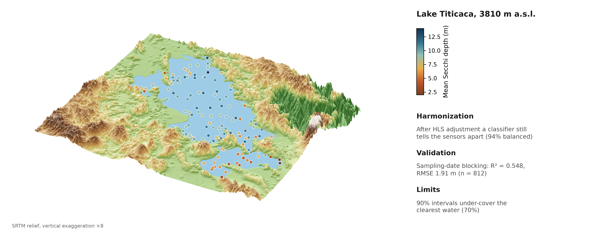
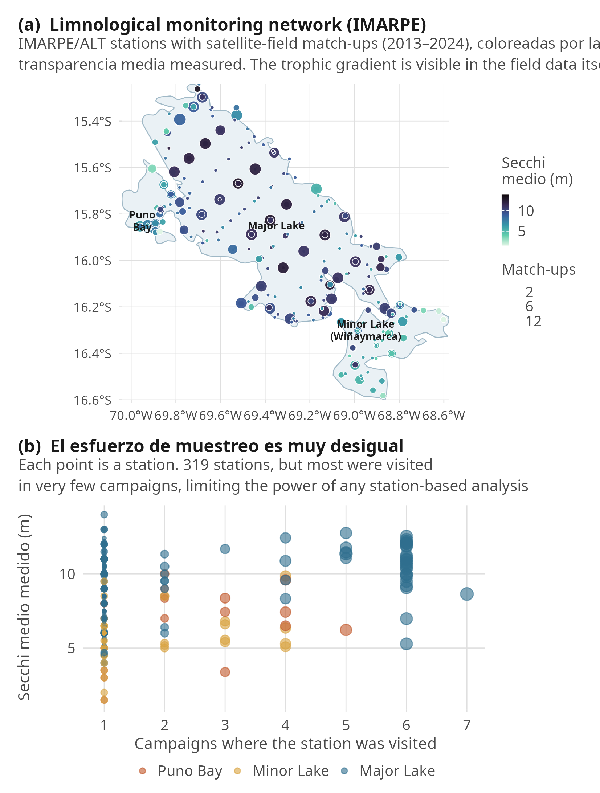
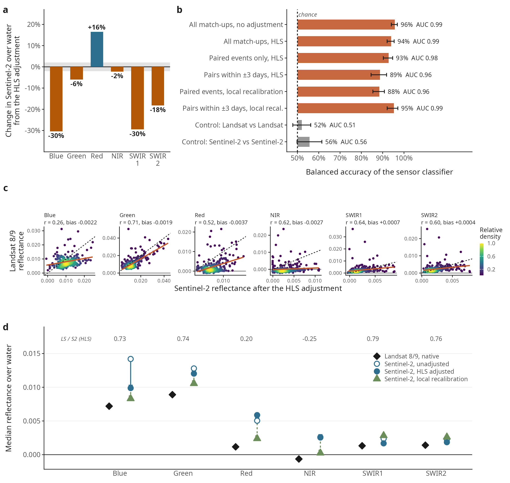
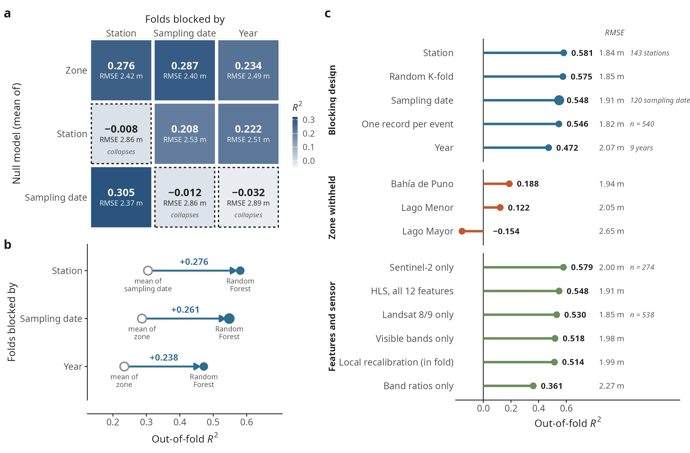
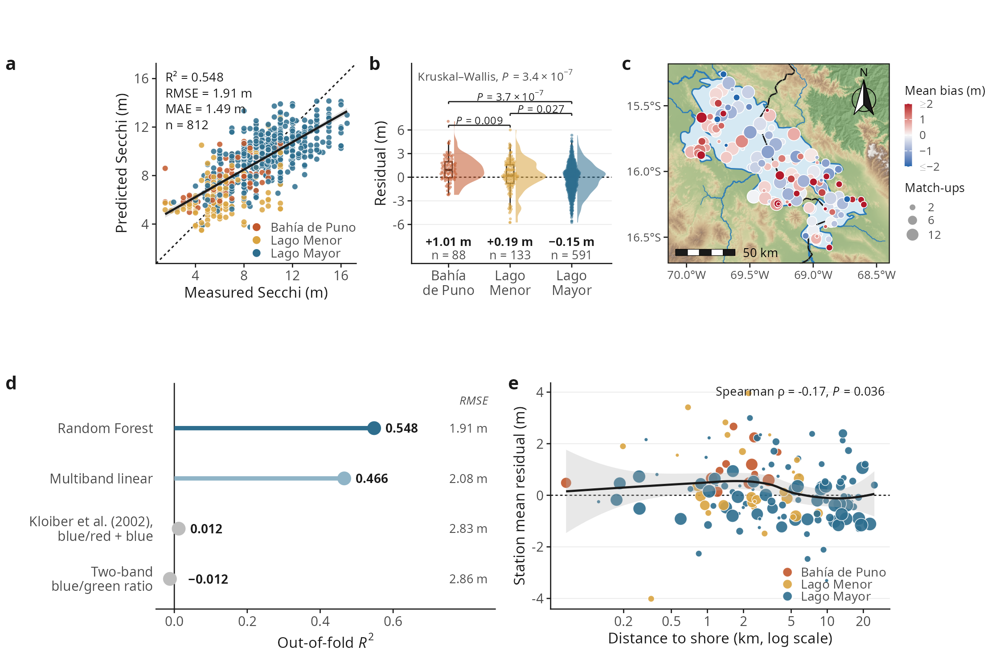
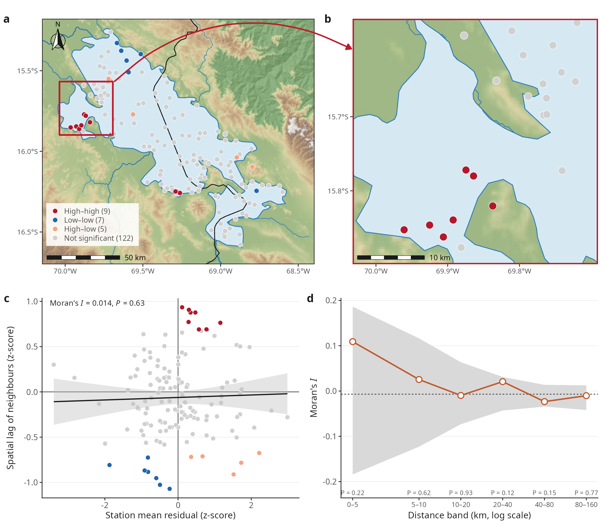
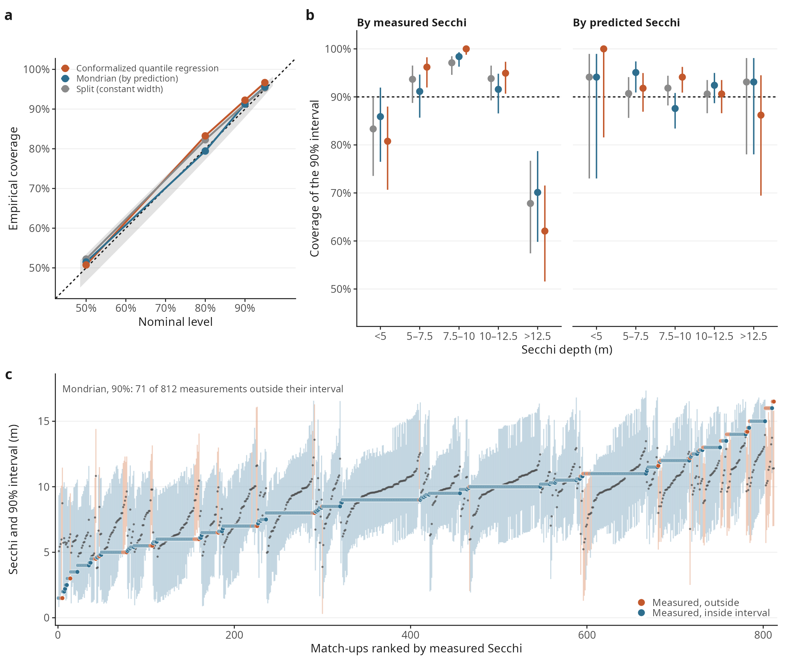
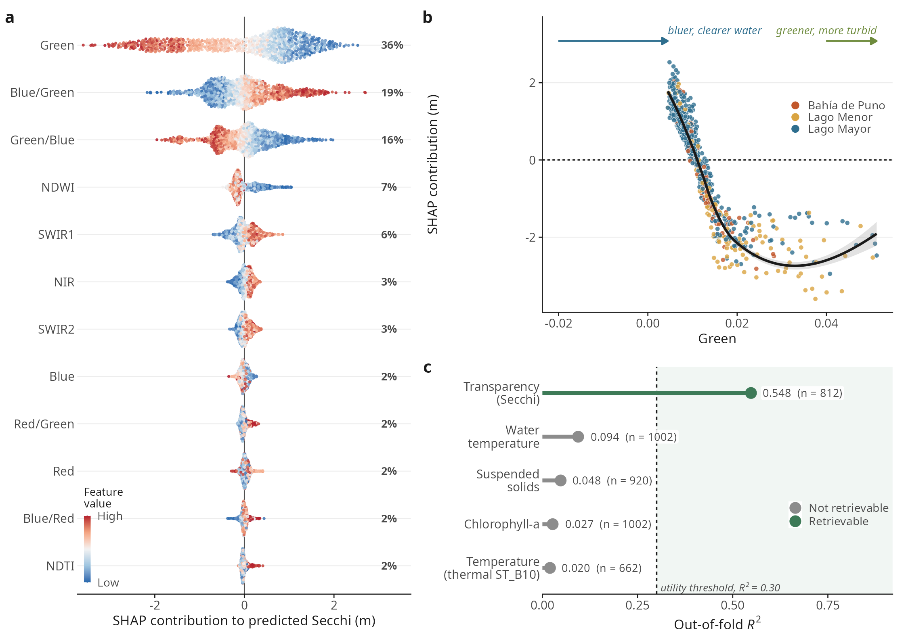

# Harmonization and Validation Limits of Satellite Secchi Retrieval in Lake Titicaca

Reproducible code and data for a study of what a defensible machine-learning water
transparency product looks like in a clear, high-altitude great lake — and of two
practices, imported from the turbid-water literature, that fail there.

[](LICENSE)
[](https://www.python.org/)
[](https://www.r-project.org/)
[](https://www.sciencedirect.com/journal/journal-of-great-lakes-research)
[](#citation)



**Manuscript:** *Harmonization and validation limits of satellite Secchi retrieval in
Lake Titicaca* — being prepared for the Journal of Great Lakes Research (Elsevier /
IAGLR). **Not yet submitted.**

This repository holds the code and the data. The manuscript itself is not mirrored
here: while it is unpublished there is no citable version of record, and a PDF in a
repository only creates ambiguity about which draft is current.

* * *

## Overview

Lake Titicaca (8,372 km², 3,810 m a.s.l.) is the largest lake in South America and, by
volume, the largest tropical lake in the world. It is a transboundary Ramsar site and
the freshwater reserve for millions of Andean people, yet its water quality is
documented only by infrequent field campaigns.



*(a) South America. (b) The northern Altiplano: SRTM relief, the endorheic basin and its
rivers (HydroSHEDS), and the Peru–Bolivia border crossing the lake. (c) The 143 IMARPE
stations with a match-up, coloured by mean measured Secchi depth — the trophic gradient,
turbid Bahía de Puno to clear Lago Mayor, is visible in the field data alone. (d) Bahía de
Puno enlarged. (e) Most stations were visited in very few campaigns.*

We assemble **1,002 real satellite–field match-ups** (812 carrying a Secchi reading)
from Sentinel-2 MSI and Landsat 8/9 OLI, 2013–2024, against the IMARPE limnological
monitoring record (2011–2024), and ask what a defensible retrieval looks like. The study is as much about
**how to evaluate** such a product as about the product itself: for each of the two
failures below we give a diagnostic that costs one model fit and that any study can run.

* * *

## Key results

Values in the manuscript's running text are macros generated by `p09`; values in its
tables are typed, and `p10` checks every one of them against `results/tidy/` on each
run, failing the build on any mismatch.

### 1. Bandpass harmonization does not make the sensors interchangeable over clear water



*(a) How much the HLS adjustment moves Sentinel-2 water reflectance in each band.
(b) Balanced accuracy of a classifier recovering the source sensor, with 95 % intervals,
against same-sensor negative controls. (c) Native Landsat against HLS-adjusted
Sentinel-2 on 270 paired events. (d) Median spectral signature at each stage.*

Sentinel-2 is adjusted to Landsat with the **HLS v2.0 bandpass coefficients** (Claverie et
al. 2018; NIR from B8A), the standard route for merging the two archives. On land the
adjustment is a few per cent. Over Lake Titicaca water it moves the signal by up to 30 %,
and the two sensors still disagree:

| Band | Blue | Green | Red | NIR | SWIR1 | SWIR2 |
|---|:--:|:--:|:--:|:--:|:--:|:--:|
| HLS change to S2 water reflectance | −30 % | −6 % | +17 % | −2 % | −30 % | −18 % |
| Landsat / adjusted S2, 270 paired events | 0.76 | 0.75 | 0.20 | −0.26 | 0.99 | 0.93 |

A Random Forest recovers the **source sensor** from the harmonized reflectance, under
folds blocked by sampling date:

| Test | Balanced accuracy | AUC |
|---|:--:|:--:|
| All harmonized features | **94.0 %** | 0.99 |
| Paired events only (same station and date) | 92.8 % | 0.98 |
| Both images within ±3 days | 88.7 % | 0.96 |
| After a local recalibration fitted in each fold | 90.0 % | 0.98 |
| Negative control: Landsat vs Landsat (random labels) | 52.0 % | 0.51 |
| Negative control: Sentinel-2 vs Sentinel-2 | 55.7 % | 0.56 |

The controls sit at chance; the real test does not. Compositing, pixel size and
acquisition date do not explain it. The residual comes from processing: both products
are corrected for the atmosphere by land processors, and over water whose signal is
0.001–0.01 their differences are as large as the signal. Native Landsat red is zero or
negative in 14 % of the match-ups.

> **Diagnostic:** a classifier two-sample test with same-sensor controls. If a
> classifier can still tell the sensors apart after harmonization, the harmonization
> has not worked.

The test is packaged as a standalone function (numpy, pandas and scikit-learn only) that
can be copied into another project:

```python
from harmonization_check import harmonization_check
harmonization_check(df, features=["B2", "B3", "B4", "B8", "B11", "B12"],
                    sensor_col="sensor", group_col="sampling_date")
#         test    n  balanced_accuracy   auc
#      sensors  812               0.94  0.99   <- the sensors are still separable
#   control_S2  274               0.44  0.41   <- same sensor, random halves: chance
#   control_LS  538               0.47  0.45
```

### 2. The sampling date, not the station, is the blocking unit



*(a) Three null models under each blocking design. (b) Skill of the Random Forest
beyond the best surviving null. (c) Out-of-fold R² under each validation design,
feature set and single sensor.*

Blocking cross-validation by monitoring station is the usual remedy for spatial
autocorrelation. In a campaign-based programme it leaves the dominant dependence
untouched. Three null models — each predicting **only the training-set mean of one
grouping** — under each blocking design:

| Null model ↓ / folds blocked by → | Station | Sampling date | Year (= whole campaign) |
|---|:--:|:--:|:--:|
| Zone mean | 0.276 | 0.287 | 0.234 |
| Station mean | −0.008 | 0.208 | 0.222 |
| Sampling-date mean | **0.305** | −0.012 | −0.032 |

Each unit collapses its own null by construction — that is the diagonal, and it proves
nothing. What matters is what survives off it: under **station-blocked** folds a null
that knows only the sampling date still explains **R² = 0.305**. The temporal structure
passes through station blocking untouched. The zone mean explains 0.23–0.29 under
*every* design, which is the trophic gradient — a property of the lake a model should
learn, not leakage.

Consistently, station blocking barely changes the reported accuracy:

| Validation design | R² | RMSE (m) | n |
|---|:--:|:--:|:--:|
| Random K-fold | 0.575 | 1.86 | 812 |
| Station-blocked | 0.581 | 1.84 | 812 |
| **Sampling-date-blocked (primary)** | **0.548** | **1.91** | 812 |
| Year-blocked (= whole campaign) | 0.472 | 2.07 | 812 |
| One record per in-situ event | 0.546 | 1.82 | 540 |

The nine field campaigns span 7–27 days each (median 13 sampling dates), so
date-blocking can still put two days of one campaign on opposite sides of a split.
Year-blocking isolates whole campaigns and gives 0.472; the 0.076 gap bounds the
residual within-campaign dependence. Date-blocking stays primary because nine
year-groups leave too few folds for stable cross-validation and conformal calibration.
Both figures are reported.

> **Diagnostic:** run every candidate null under every candidate blocking design, and
> read the off-diagonal.

### 3. Retrieval, benchmarks and where it stops working



*(a) Out-of-fold predicted vs measured. (b) Residuals by trophic zone. (c) Mean bias by
station. (d) Benchmark against the classical and linear baselines. (e) Station mean
residual against distance to shore.*

Random Forest, sampling-date-blocked: **R² = 0.548, RMSE 1.91 m, MAE 1.49 m,
bias +0.03 m (n = 812)**.

| Model | R² | RMSE (m) |
|---|:--:|:--:|
| **Random Forest (this study)** | **0.548** | 1.91 |
| Multiband linear regression (winsorized inputs) | 0.466 | 2.08 |
| Kloiber et al. (2002), blue/red + blue | 0.012 | 2.83 |
| Two-band blue/green log ratio | −0.012 | 2.86 |

The classical band-ratio algorithms have no skill in this water, in their original form
and bounded to a physical range. A multiband linear model gets most of the way; the
Random Forest adds 0.08 in R².

Errors are not a near-shore adjacency artefact: the station mean residual is only
weakly related to distance from shore (Spearman ρ = −0.17, P = 0.036) and its magnitude
not at all (ρ = 0.00).

**Extrapolation fails.** Withholding an entire trophic zone:

| Held-out zone | R² | RMSE (m) | Bias (m) |
|---|:--:|:--:|:--:|
| Lago Menor | 0.122 | 2.05 | +0.18 |
| Bahía de Puno | 0.188 | 1.94 | +1.25 |
| Lago Mayor | −0.154 | 2.65 | −1.67 |

The model interpolates within optical regimes it has seen; it does not transfer to a
water type absent from training.

### 4. The match-up window is not what drives the result

A ±10-day window is wide for a lake whose near-shore transparency responds to wind and
river discharge within days. Every match-up was re-extracted at four windows and
re-evaluated under the primary design:

| Window | Match-ups | Campaigns | R² | RMSE (m) |
|---|:--:|:--:|:--:|:--:|
| ±1 day | 185 | 41 | 0.473 | 2.33 |
| ±3 days | 494 | 79 | 0.524 | 2.12 |
| ±5 days | 660 | 94 | 0.553 | 2.00 |
| **±10 days** | **810** | **120** | **0.553** | **1.91** |

Accuracy is flat from ±3 to ±10 days. Had the wide window been admitting stale
observations, tightening it should have raised accuracy; it does not. What narrowing
costs is data — ±1 day keeps 185 of 810 match-ups and 41 of 120 sampling dates, too
few for the validation design this study argues for. RMSE is not comparable across rows,
because each window defines a different sample.

The re-extraction doubles as a reproducibility check: at ±10 days it recovers **810 of
810** unique match-ups from the published analysis, with per-band reflectance
correlating at **r ≥ 0.988** and a median difference of zero. For Landsat it also checks
the stored values: the match-up tables keep Landsat after the OLI→ETM+ transform of Roy
et al. (2016), which the pipeline inverts, and the inverted reflectance matches the
directly read Collection 2 values for all 537 Landsat match-ups (r > 0.9999, median
absolute difference 2.8 × 10⁻⁶).

The extraction it rests on is versioned
(`data/processed/window_sensitivity_raw.csv`, 184 KB), so the analysis re-runs from this
repository with `python pipeline/p11_window_sensitivity.py --eval`. Re-extracting from
scratch is the only stage that needs Earth Engine credentials.

### 5. Retrieval errors are not spatially clustered



*(a) Local Moran (LISA) class of each station's mean residual. (b) Bahía de Puno.
(c) Moran scatter plot. (d) Moran's I by distance band against the permutation envelope.*

If the errors that survive sampling-date blocking were clustered in space, the design
would still leak spatial information between folds. They are not. Over the 143
stations, Moran's I of the mean residual is **0.014 (P = 0.63)** with six neighbours and
stays between 0.014 and 0.055, never significant, for four to ten; no distance band
from 0 to 160 km leaves its permutation envelope. Locally, 21 stations reach P < 0.05
against about 7 expected by chance, 7 of the 9 high–high ones in the Bahía de Puno,
where the model overestimates, but **none survives Benjamini–Hochberg correction**. The
bay's overestimation is the zone-level bias of section 3, not an independent spatial
signal. Moran and LISA are implemented directly in `p12` with permutation tests, with no
PySAL dependency.

### 6. The offset is not particular to Lake Titicaca

The same comparison, run on **6 large lakes with no field data at all** (300 open-water
points each, 1 km from shore, seasonal medians 2021–2024), native Landsat against
HLS-adjusted Sentinel-2:

| Lake | Water | S2 green | Blue | Green | Red |
|---|---|--:|--:|--:|--:|
| Tahoe | clear | 0.0087 | 1.13 | 0.91 | −0.03 |
| Titicaca | clear | 0.0145 | 0.51 | 0.56 | 0.10 |
| Baikal | clear | 0.0171 | 0.58 | 0.69 | 0.14 |
| Malawi | clear | 0.0262 | 0.31 | 0.44 | 0.01 |
| Erie | turbid | 0.0407 | 0.29 | 0.43 | 0.12 |
| Okeechobee | turbid | 0.0410 | 0.29 | 0.63 | 0.62 |

A harmonization that made the sensors interchangeable would give 1. In **5 of the 6
lakes** native Landsat blue and green lie more than 20 % below adjusted Sentinel-2, in
clear and turbid water alike, and the departure has no monotone relation with clarity
(Spearman 0.54, n = 6) — what a processing difference, not a spectral one, would
produce. These are seasonal medians, not same-day pairs, so they check the offset
rather than replace the paired analysis of section 1.

### 7. Uncertainty is calibrated for what the user sees, not for the true value



*(a) Empirical vs nominal coverage for three conformal methods. (b) Coverage of the 90 %
interval by range of measured and of predicted Secchi depth. (c) Every Mondrian 90 %
interval, ranked by measured Secchi.*

Calibration uses whole sampling dates held out inside each training fold, with the
finite-sample quantile.

| 90 % interval | Coverage | Mean width (m) | By predicted value | Clearest measured water |
|---|:--:|:--:|:--:|:--:|
| Split (constant width) | 91.3 % | 7.10 | — | — |
| **Mondrian (by prediction)** | **91.3 %** | **7.02** | 87.6–95.1 % | 70.1 % |
| Conformalized quantile regression | 92.2 % | 8.02 | — | 62.1 % |

Conditional on the predicted value — what a map user sees — the Mondrian interval
holds its coverage in every range. Conditional on the true value it does not: in the
clearest water the model predicts too low and the interval covers only 70 %. A
marginal coverage figure alone would hide this; a predicted value near the top of the
range should be read as a lower bound.

### 8. Only transparency is retrievable in this water



*(a) Out-of-fold SHAP importance. (b) SHAP dependence on the leading feature, by zone.
(c) Retrievability of each variable under the same design.*

The same honest design applied to every co-measured variable:

| Variable | R² | n | Retrievable |
|---|:--:|:--:|:--:|
| Transparency (Secchi) | **0.548** | 812 | ✅ |
| Water temperature (in-situ) | 0.094 | 1,002 | ❌ |
| Suspended solids | 0.048 | 920 | ❌ |
| Chlorophyll-*a* | 0.027 | 1,002 | ❌ |
| Temperature (thermal ST_B10) | 0.020 | 662 | ❌ |

Their in-situ ranges lie below the optical and thermal detection limits of these sensors
in this oligotrophic regime. Out-of-fold SHAP attributes 73.2 % of the retrieval to
green and blue bands and their ratios, green reflectance alone 35.9 %, with the sign
expected from water-clarity optics — so the retrieval is grounded in optics rather than
location memorization. The negative claim is
held to the same standard as the positive one.

* * *

## Repository structure

```
.
├── pipeline/                 the analysis, in execution order
│   ├── p00_config.py                    paths, features, seed, shared validation design
│   ├── p01_build_dataset.py             analysis dataset + real inventory of gaps
│   ├── p02_fix1_harmonization.py        HLS adjustment over water, sensor two-sample test
│   ├── p03_fix2_baselines.py            classical (Kloiber 2002) and linear baselines
│   ├── p04_fix3_validation.py           blocking unit, null-model grid
│   ├── p05_fix4_temporal.py             temporal hold-out, seasonality, trend fragility
│   ├── p06_model_selection.py           nested CV + Optuna (slow, ~1 h)
│   ├── p07_uncertainty.py               conformal intervals, marginal and conditional
│   ├── p08_interpretability.py          out-of-fold SHAP + retrievability
│   ├── p09_export_manuscript_numbers.py exports every figure quoted in the text
│   ├── p10_verify_manuscript.py         checks the article against results/tidy/
│   ├── p11_window_sensitivity.py        match-up window ±1/±3/±5/±10 d (needs GEE)
│   ├── p12_spatial_autocorrelation.py   Moran's I, correlogram and LISA of the residuals
│   ├── p13_multilake_harmonization.py   the Landsat/S2-HLS offset on 6 large lakes (needs GEE)
│   ├── harmonization_check.py           the sensor two-sample test as a reusable function
│   └── run_all.sh                       reproduces everything, end to end
├── figures/
│   ├── R/                    fig01–fig10 (ggplot2) + shared theme and palette
│   └── basemap/              fetch_basemap.py: borders, rivers and relief for the maps
├── data/
│   ├── processed/            match-up tables (matchups_s2.csv, matchups_ls.csv),
│   │                         insitu_annual_medians.csv (input to the trend tests)
│   │                         window_sensitivity_raw.csv (p11) and
│   │                         multilake_reflectance_raw.csv (p13)
│   ├── basemap/              Natural Earth borders, HydroSHEDS basin and rivers, SRTM
│   │                         relief (about 4 MB, so the maps rebuild offline)
│   ├── insitu/reference/     OEFA 2016 reference values and source metadata
│   └── lake_boundary/        lake geometry (Natural Earth, GPKG)
├── results/
│   ├── metrics/              one JSON per pipeline stage
│   ├── tidy/                 every table behind every figure, as CSV
│   └── figures_r/            manuscript figures (300 dpi PNG + vector PDF)
├── requirements.txt
└── LICENSE
```

Trained models and LaTeX sources are not versioned. The manuscript lives outside this
repository (see above); `p09` and `p10` detect its absence and skip.

* * *

## Installation

Python 3.14 (the results were produced with 3.14.7). The pinned versions are those the
reported results were produced with.

```bash
git clone https://github.com/Andre031222/harmonized-titicaca-transparency.git
cd harmonized-titicaca-transparency

python3.14 -m venv .venv          # or: uv venv --python 3.14
.venv/bin/pip install -r requirements.txt
```

`run_all.sh` expects the interpreter at `.venv/bin/python`. Verify:

```bash
.venv/bin/python -c "import numpy, pandas, sklearn, xgboost, lightgbm, optuna, shap; print('ok')"
```

Figures are built in R (≥ 4.4), not Python:

```r
install.packages(c("ggplot2","patchwork","dplyr","tidyr","readr",
                   "forcats","scales","stringr","sf","terra","tidyterra",
                   "ggspatial","ggnewscale","cowplot","ggdist","ggbeeswarm",
                   "jsonlite","MASS","png","ragg","viridis"))
```

* * *

## Reproducing the results

Everything in the article is reproducible from this repository alone — no Earth Engine
credentials and no access to the raw in-situ record needed. This is checked by running
the pipeline in a clean checkout: it reproduces all seven metric files and all 26 tidy
tables byte-identically.

```bash
bash pipeline/run_all.sh            # everything (~1.5 h, p06 dominates)
bash pipeline/run_all.sh --fast     # skip p06 model selection
bash pipeline/run_all.sh --no-tex   # skip the LaTeX build
```

| # | Stage | What it does |
|---|---|---|
| 1 | `p01_build_dataset` | Builds the analysis table from the match-ups; reports the real temporal inventory — which years and months have no data at all |
| 2 | `p02_fix1_harmonization` | Applies the HLS adjustment and measures it over water; runs the classifier two-sample test with paired, ±3-day and negative controls; fits a descriptive local recalibration |
| 3 | `p04_fix3_validation` | The null-model grid, the blocking hierarchy, leave-one-zone-out, error by zone |
| 4 | `p03_fix2_baselines` | Kloiber (2002), two-band ratio and multiband linear baselines (imports from `p04`, so it runs after) |
| 5 | `p05_fix4_temporal` | Temporal hold-out, seasonal coverage, dry-season Mann–Kendall trends and their sensitivity to season and start year |
| 6 | `p06_model_selection` | RF / ExtraTrees / XGBoost / LightGBM, tuned by Optuna inside nested CV, against seed-to-seed noise |
| 7 | `p07_uncertainty` | Split, Mondrian and CQR conformal intervals; coverage marginal **and** conditional on measured and predicted transparency |
| 8 | `p08_interpretability` | Out-of-fold SHAP; retrievability of every co-measured variable |
| 9 | `p12_spatial_autocorrelation` | Global Moran's I of the station residuals, distance correlogram, LISA with FDR control |
| 10 | `p09` → `p10` | Exports the numbers, then verifies the article against `results/tidy/` |

One analysis sits outside `run_all.sh` because it is the only step that needs Earth
Engine credentials. `p11` re-extracts the match-ups at ±1, ±3, ±5 and ±10 days and
re-evaluates the retrieval under the primary design, testing whether the ±10-day
window is too wide for a lake where wind and river discharge can shift transparency
within days:

```bash
earthengine authenticate          # once
python pipeline/p11_window_sensitivity.py          # extract, then evaluate
python pipeline/p11_window_sensitivity.py --eval   # re-evaluate the cache only

python pipeline/p13_multilake_harmonization.py         # 6 lakes, extract and evaluate
python pipeline/p13_multilake_harmonization.py --eval  # re-evaluate the cache only
```

Extraction is resumable and network-bound rather than CPU-bound.

Figures are rebuilt separately:

```bash
cd figures/R && for f in fig[0-9]*.R; do Rscript "$f"; done
```

Outputs land in `results/metrics/` (JSON), `results/tidy/` (CSV) and
`results/figures_r/` (PNG + PDF). A re-run leaves the tracked outputs byte-identical.

### Validation design

```
                      ┌─ random K-fold ──────────── 0.575   leaks
                      ├─ blocked by STATION ─────── 0.581   leaks (the null grid proves it)
   812 match-ups ─────┼─ blocked by SAMPLING DATE ─ 0.548   primary
   9 campaigns        ├─ blocked by YEAR ────────── 0.472   strict campaign-level bound
   2013–2024          └─ leave-one-zone-out ─────── 0.19 to −0.15   extrapolation fails
```

The blocking unit is diagnosed rather than assumed, the scaler is fitted inside the
training fold only, and SHAP is computed out of fold so each observation is explained
by a model that never saw it.

* * *

## Data

| Source | What | Availability |
|---|---|---|
| **IMARPE** limnological campaigns | In-situ Secchi, chlorophyll-*a*, suspended solids, temperature, pH, dissolved oxygen, nutrients — 881 measurements, 2011–2024, 160 station identifiers (154 distinct stations), 734 with a valid Secchi reading | Published monitoring records; the July 2019 campaign is in Siguayro & Franco (2022). The raw compilation is not redistributed here — available on request |
| **OEFA (2016)** | Reference values, inner Puno Bay | Public government report |
| **Sentinel-2 MSI / Landsat 8-9 OLI** | Surface reflectance, Collection 2 Level-2 | Free via [Google Earth Engine](https://earthengine.google.com) |
| **Match-up tables** (`data/processed/`) | 1,002 satellite ↔ in-situ pairs (340 Sentinel-2, 662 Landsat 8/9); 812 carry a Secchi reading | **Versioned in this repository** |
| **Annual medians** (`data/processed/insitu_annual_medians.csv`) | Median Secchi per trophic zone, year and season, 2011–2024, with the count behind each — the input the Mann–Kendall tests actually consume | **Versioned in this repository** |

Trends are computed on the full in-situ record rather than the match-up subset, because
they are a claim about the lake and not about cloud-free image availability. That record
is IMARPE's and is not redistributed, so the zone–year aggregate it reduces to is
versioned instead: without it, a clone could not run past `p05`. When the raw file is
present the aggregate is recomputed and rewritten.

Match-ups pair each in-situ measurement with the cloud-masked median reflectance in a
30 m buffer at the true station coordinate, from imagery within ±10 days. The Earth
Engine extraction that produced the tables is in the git history
(`scripts/_legacy/10_build_matchups.py`, `12_build_matchups_landsat.py`), superseded by
`pipeline/`.

> **Provenance check:** our 2019 zone-level means reproduce the published IMARPE values
> almost exactly — Lago Mayor conductivity 1513.4 vs 1513.5 µS/cm, Lago Menor
> chlorophyll-*a* 1.52 vs 1.52 mg/m³. **No synthetic or spectrally derived labels are
> used at any stage.**

* * *

## Authors

Listed in the order of the manuscript.

| Author | Affiliation | ORCID |
|---|---|---|
| **Dina Maribel Yana-Yucra** | UNAP | [0009-0003-6218-2735](https://orcid.org/0009-0003-6218-2735) |
| **Vladimiro Ibañez-Quispe** | UNAP | [0000-0002-0277-4945](https://orcid.org/0000-0002-0277-4945) |
| **Wilfredo Julián Yzarra-Tito** | SENAMHI | [0000-0002-7357-5943](https://orcid.org/0000-0002-7357-5943) |
| **Richar Andre Vilca-Solorzano** \* | UNAP | [0009-0003-2385-5263](https://orcid.org/0009-0003-2385-5263) |
| **Fred Torres-Cruz** | UNAP | [0000-0003-0834-6834](https://orcid.org/0000-0003-0834-6834) |

UNAP — Faculty of Statistical and Computer Engineering, Universidad Nacional del
Altiplano, Puno, Peru. SENAMHI — Servicio Nacional de Meteorología e Hidrología del
Perú, Lima, Peru.

<sub>\* Corresponding author — <75521963@est.unap.edu.pe></sub>

The CRediT statement is in the article.

* * *

## Citation

The manuscript is not yet published. If you use this code or the match-up tables,
cite the repository and check back for the article reference:

```bibtex
@misc{titicaca_transparency_code,
  author = {Yana-Yucra, Dina Maribel and Iba{\~n}ez-Quispe, Vladimiro
            and Yzarra-Tito, Wilfredo Juli{\'a}n
            and Vilca-Solorzano, Richar Andre and Torres-Cruz, Fred},
  title  = {Harmonization and validation limits of satellite {Secchi}
            retrieval in {Lake Titicaca}: analysis code and match-up data},
  year   = {2026},
  howpublished = {\url{https://github.com/Andre031222/harmonized-titicaca-transparency}}
}
```

* * *

## Limitations

- **Dry season only.** Every match-up falls between July and October. The monitoring
  programme produced one wet-season campaign in fourteen years and it predates both
  satellites, so wet-season blooms in Bahía de Puno — the phenomenon a transparency
  product would most usefully warn about — are entirely unrepresented. The binding
  constraint is field sampling, not sensing.
- **Interpolation, not transfer.** Skill collapses when an entire trophic zone is
  withheld. Integration must be incremental: each new campaign both validates the
  current map and extends the training set.
- **Episodic record.** No campaigns in 2020, 2021 or 2023, so a hold-out described as
  "2022–2024" contains only 2022 and 2024, and the trend analysis rests on 8–10
  dry-season annual values.
- **Fragile trends.** On the dry-season series only Lago Mayor rises significantly
  (Sen +0.30 m/yr, P = 0.012). Adding the single wet-season campaign (December 2012)
  erases that trend (P = 0.14), and Bahía de Puno turns significant or not depending
  on the start year. Both series and every start year are reported.
- **Coarse reference.** 87% of the Secchi readings are multiples of 0.5 m, giving
  only 73 distinct values across 812 match-ups, so an RMSE of 1.91 m is within a small
  multiple of the granularity of the reference measurement itself.
- **Land surface reflectance only.** Both sensors enter as land products. A water-specific
  atmospheric correction (ACOLITE, Polymer), harmonized at the level of remote-sensing
  reflectance as in Page et al. (2019), is the natural next test.
- **One lake with field data.** The two diagnostics are general; the water-specific
  coefficients are local to Titicaca and must be refitted elsewhere.

* * *

## License

Code and documentation: MIT, see [LICENSE](LICENSE).
Sentinel-2 and Landsat imagery is free and open (ESA / USGS).
In-situ measurements derive from published IMARPE, ALT and OEFA monitoring records.

*We thank IMARPE, ALT and OEFA for the publicly available monitoring records that made
this study possible. This research received no external funding.*
